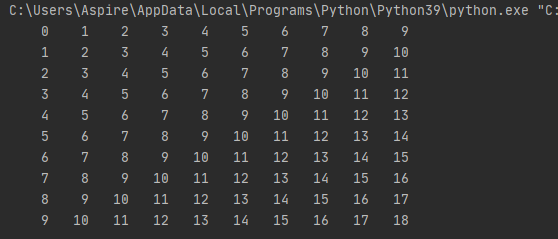

# PERTEMUAN 7
### NAMA: INDIRA ALINE <br>
### KELAS: TI. 20. A. 1 <br>
### NIM: 312010042 <br>

__________________________________________________________________________________

Jadi pada pertemuan ini saya diberikan beberapa tugas oleh dosen saya yaitu diantaranya:

## PRAKTIKUM 1 - LATIHAN 1

 <br>

Pada tugas pertama, saya diminta untuk membuat sebuah program pengulangan bertingkat yang nantinya akan menghasilkan output seperti gambat diatas.
Untuk bisa dapat menghasilkan output tersebut maka saya memasukan syntax:
```python
baris = 10
kolom = baris

for bar in range(baris):
    for col in range(kolom):
        tab = bar+col
        print("{0:>5}".format(tab), end='')
    print()
```
Mengapa demikian? Karena untuk dapat melakukan pengulangan bertingkat kamu perlu memasukan 
```python
for bar in range(baris):
    for col in range(kolom):
        tab = bar+col
        print("{0:>5}".format(tab), end='')
    print()
```
dan karena pada syntax tersebut kamu membutuhkan baris dan kolom maka sebelum memasukan syntax diatas kamu perlu menambahkan keterangan baris dan kolom sesuai yang kalian butuhkan seperti ini.
```python
baris = 10
kolom = baris
```
Jika sudah memasukan semua syntax diatas dan telah di run, maka kamu akan mendapatkan tampilan seperti gambar yang ada dibawah ini
 <br> 

